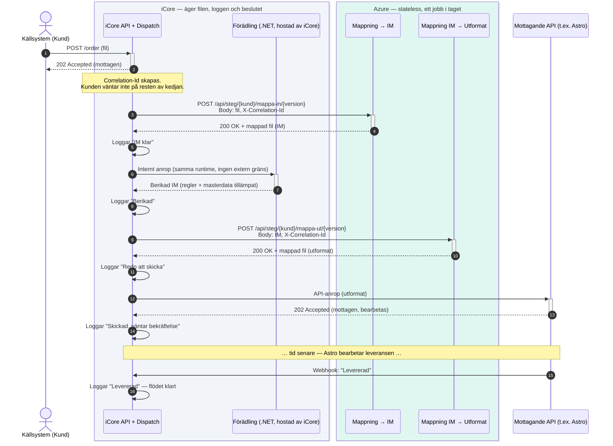

# Sekvensdiagram: order genom iCore och Azure

**Sam:** Ett sekvensdiagram visar något ett arkitekturblock inte kan — *ordningen* och *vem som väntar på vem*. Det är rätt verktyg för att svara på "vad hanteras var", eftersom svaret inte bara är en lista utan en tidslinje: iCore äger filen och loggen genom hela kedjan; Azure kliver in, gör exakt ett jobb utan minne av något annat, och kliver ut igen.

Notation: heldragen pil = anrop, streckad pil = svar, den lodrätta stapeln på en livslinje = "detta system arbetar just nu", `Note` = något som händer utan ett meddelande (loggning, tidsgap).

## Vad som hanteras och sparas var

**I iCore, genom hela kedjan:**
- Filen/ordern själv — iCore skickar den till nästa steg och tar alltid tillbaka resultatet. Den lämnar aldrig iCores ägarskap, den bara besöker Azure för ett jobb i taget.
- `Correlation-Id` och all loggning — varje rad i tidslinjen ovan loggas mot samma id, det är det som gör att hela ordern går att följa som en enda historia i portalen istället för fem lösryckta rader.
- Förädlingslogiken — regler och masterdata som redan finns i produkten, körs som ett internt anrop utan att lämna iCores runtime.
- Beslutet om *vilken* mappningsversion som ska köras för den här kunden (dispatchen).

**I Azure, ett anrop i taget:**
- Själva mappningskoden — tar emot data, lämnar tillbaka mappad data, håller inget minne mellan anrop. Om Azure-tjänsten startas om mitt i natten märks det aldrig, för den sparar ingenting den behöver komma ihåg.
- Ingen egen kopia av filen sparas där — kommer in i anropet, lämnar i svaret, klart.

**Det enda steget som inte är ett rakt call-och-svar:** anropet till Astro. Där skiljer sig mönstret av ett tredje skäl — inte var koden bor, utan att mottagaren är ett system iCore inte styr svarstiden på. Därför får kunden ett snabbt 202 direkt (`Kund->>+iCore`-raden längst upp), medan bekräftelsen från Astro kan komma en bra stund senare via ett separat webhook-anrop, utan att något i kedjan behöver stå och vänta under tiden.
